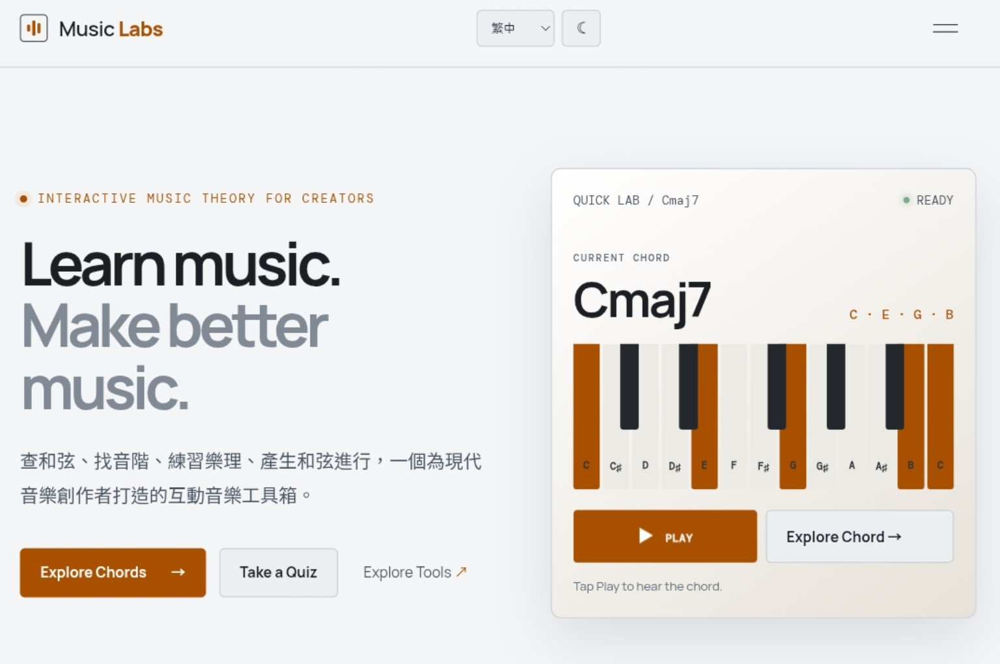

[繁體中文](README.md) · [English](README.en.md)

# 🎵 Music Labs

> Learn music. Make better music.

Music Wiki × Creator Tools × Music Tech × Artist Community

**[🌐 Visit Music Labs](https://music-labs.pages.dev/)**

## What is Music Labs?

Music Labs is an interactive platform for music learners and creators. It connects chords and scales with practical creative tools, music-tech discoveries, and an artist community—so music theory can move directly into the creative process.

## Music Wiki

- **Chord Explorer** — inspect chord notes, formulas, and intervals, then hear them.
- **Scale Explorer** — explore scales, modes, and keyboard positions.
- **Theory Library** — browse chord and scale structures.
- **Music Quiz** — practice chords, scales, and note structures with focused quizzes.

## Creator Tools

- **Progression Lab** — find four-chord creative starting points by key and mood.
- **Transpose** — transpose extended and slash chords quickly.
- **BPM Calculator** — calculate note and delay timings.
- **Tap Tempo** — capture a song's tempo by tapping.
- **Circle of Fifths** — explore keys, scales, and functional harmony interactively.

## Discover

Selected resources and updates for music creators:

`AI Music` · `Plugins` · `Software` · `Hardware` · `Free Resources` · `Tutorials` · `Music Tech`

## Artist Community

- **Artists** — meet published music creators.
- **Works** — explore creator releases.
- **Notes** — read creative stories and notes.
- **Artist Submission** — submit an artist profile for review and publication.

## Screenshots

[](https://music-labs.pages.dev/)

## Tech Stack

- React 19, Next.js 16, TypeScript
- Vinext, Vite, Tailwind CSS
- Cloudflare Pages and Cloudflare Pages Functions
- Web Audio API and Tonal.js

## Local Development

Requires Node.js 22.13.0 or later.

```bash
npm ci
npm run dev
```

```bash
npm run build
npm run lint
npm run start
```

## Project Structure

```text
app/                 Application entry points and routes
functions/api/       Cloudflare Pages Functions
lib/                 Music-theory and audio source modules
public/              Pages, styles, browser scripts, and static assets
data/                Artist data
docs/images/         Local README images
scripts/             Build and runtime helpers
```

## Project Status

**V2** is under active development. Music Labs will continue to expand its theory content, creator tools, Discover resources, and artist community.

## Contributing

Issues and pull requests are welcome for content corrections, tool suggestions, and improvements. Never commit API keys, passwords, or other sensitive data to GitHub; keep deployment secrets in Cloudflare environment variables.

## License / Maintainer

License: Not specified.

Created and maintained by [Derex Lee](https://github.com/derex0721).
